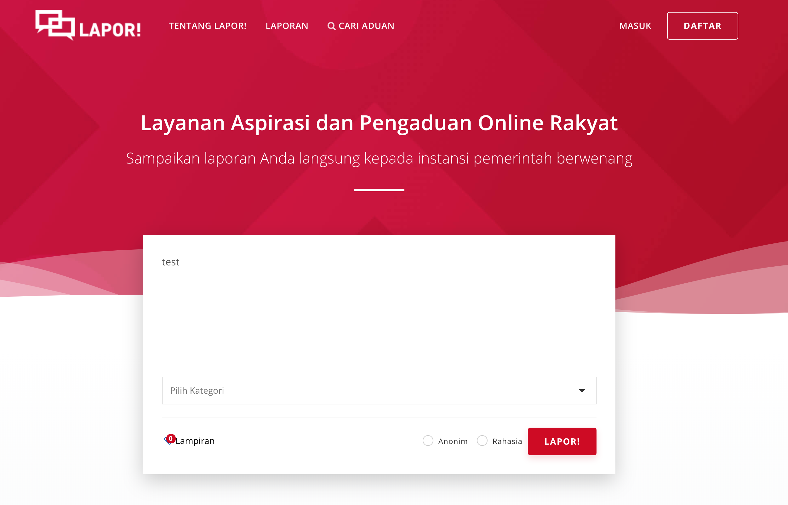
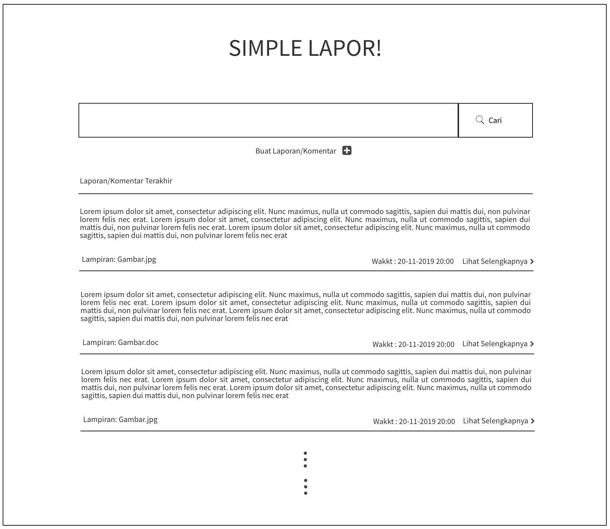

## Simple `LAPOR` :heavy_exclamation_mark:
Anda mengetahui aplikasi `lapor` yang dibuat oleh pemerintah republik indonesia? jika tidak silahkan kunjungi 
http://lapor.go.id, maka anda akan mendapatkan laman seperti gambar di bawah

Kali ini kita akan membuat aplikasi web seperti `lapor` untuk mengumpulkan laporan/komentar terkait layanan
di program studi teknik informatika ITERA.
**Luangkan waktu untuk membaca spesifikasi ini sampai selesai.** :kissing_heart:

### Anggota Tim :cyclone:
Project dikerjakan secara **berkelompok** dengan maksimal jumlah anggota adalah 2-3 orang mahasiswa (maksimal 3 orang mahasiswa!).

### Petunjuk Pengerjaan :umbrella:
1. Fork pada repository ini dengan akun github anda.
2. Silakan commit pada repository anda (hasil fork). Lakukan berberapa commit dengan pesan yang bermakna,
contoh: fix css, membuat post done, jangan seperti final, benerin dikit, oke deh, update deh dll. 
Disarankan untuk tidak melakukan commit dengan perubahan yang besar karena akan mempengaruhi 
penilaian (contoh: hanya melakukan satu commit kemudian dikumpulkan).
3. Minimal commit sebanyak personil anggota tim dengan masing-masing personil tim melakukan commit sesuai dengan kesepakatan tim, penilaian individu akan dilihat.
4. Ubah **Penjelasan Teknis** pada bagian bawah readme.md ini dengan menjelaskan bagaimana cara anda:
   - Instalasi Framework, Koneksi basis data 
   - Melakukan validasi pada client-side
   - Melakukan AJAX (mulai dari pengguna melakukan klik pada tombol LAPOR! sampai laporan/komentar terkirim).
5. Pull request dari repository anda ke repository ini dengan 
format **NIM** - **Nama Lengkap**. **Waktu terkahir proses pull request adalah 4 hari setelah 
ujian akhir semester (UAS)**
6. Data yang dikumpulkan adalah:
   - Source code aplikasi
   - Basis data, dan
   - Cara instalasi aplikasi anda
7. Penilaian:
   - Kerjasama tim
   - Kesesuaian dengan spesifikasi
   - Pemahaman dalam penggunaan framework, penilaian efisiensi query
   - Antarmuka aplikasi
   - Bug free :beetle:
   
### Tools :hammer:
1. Untuk backend, wajib menggunakan PHP framework apapun (Contoh: Codeigniter, Laravel, Slim, Yii dll).
2. Gunakan MySQL atau basis data relasional lain untuk menyimpan data.
3. Untuk frontend, gunakan Javascript, HTML dan CSS. **Tidak boleh menggunakan library atau framework CSS atau JS seperti 
JQuery atau Bootstrap.** CSS sebisa mungkin ada di file yang berbeda (tidak inline styling/embeding styling).

### Spesifikasi Simple LAPOR!
#### Tampilan :soccer:
Anda diminta untuk membuat tampilan sedemikian hingga mirip dengan tampilan berikut. Website yang diminta tidak harus 
responsive. Desain tampilan tidak perlu dibuat indah. Icon dan jenis font tidak harus sama dengan contoh. Warna font, 
garis pemisah, dan perbedaan ukuran font harus terlihat sesuai contoh. Perhatikan juga tata letak elemen-elemen.

- Search bar diletakkan di bagian paling atas dibawah judul.
- Tombol "cari" berada di sebelah kanan search bar.
- **Buat LAPOR!** digunakan untuk mengirimkan laporan/komentar baru.
- Tampilan search bar ini harus tetap ada walaupun anda tidak mengimplementasikan fitur search.
- Tampilan pertanyaan tidak harus urut berdasarkan "Laporan/Komentar terakhir", 
namun tulisan "Laporan/komentar Terakhir" ini harus ada.

- Tampilan di atas digunakan untuk mengajukan atau mengubah laporan/komentar.
- Perhatikan label dari field pada form berada di dalam field (tidak di luar)
- Apek yang dilaporkan ditampilkan dalam bentuk `select`

- Bagian ini menampilkan laporan/komentar. Bagian `datetime` harus ada. Tanda `kuote` tidak harus ada
- Perhatikan label dari field pada form berada di dalam field (tidak di luar)

### List laporan/komentar
Halaman utama berisi daftar judul pertanyaan, siapa yang bertanya, dan isi pertanyaan. Isi pertanyaan yang terlalu 
panjang harus dipotong. Silakan definisikan sendiri seberapa panjang agar tetap baik terlihat di layout yang Anda buat.

Pada masing-masing elemen list, terdapat menu untuk mengubah dan menghapus pertanyaan.

View Laporan ditampilkan secara terurut dimulai dari laporan terakhir yang diberikan highlight

### Kirim laporan/komentar `LAPOR!`
Pengguna dapat mengajukan laporan/komentar. Form yang digunakan memiliki komentar (textarea), 
data lapiran berupa gambar 
dan file berekstention `doc, docx, xls, xlsx, ppt, pptx, pdf``. Gunakan HTTP POST.

### Ubah Laporan/komentar
Pengguna dapat mengubah laporan/komentar yang sudah dibuat. Form yang digunakan memiliki tampilan yang sama dengan 
form untuk bertanya, namun field-field yang ada sudah terisi. Gunakan HTTP POST untuk menyimpan perubahan.

### Hapus Laporan/komentar
Pengguna dapat menghapus laporan/komentar yang sudah dibuat. Lakukan konfirmasi penghapusan dengan `javascript`.

### Lihat Laporan/komentar
Pengguna dapat melihat laporan/komentar. Pada halaman ini terdapat informasi aspek yang dilaporkan.
(Dosen, Staff, Mahasiswa, Infrastruktur dan Pengajaran ), isi laporan/komentar, waktu pengiriman komentar `datetime` 
dan file lapiran. 

### Validasi
Validasi **wajib** dilakukan pada *client-side*, dengan menggunakan **javascript** bukan HTML 5 input type, yaitu:
- Setiap field pada form tidak boleh kosong.
- minimal jumlah kata dalam laporan/komentar adalah 20 kata.

### Bonus
Pengguna dapat mencari laporan/komentar dengan melakukan search ke `isi laporan/komentar`.

### Penjelasan Teknis
Anggota Kelompok : 
- Muksin Bagaskara (119140167)
- Mayang Hermanda Anggraini (1191440197)
- Cahya Andy Mareza (119140007)

instalasi framework laravel
1. instal composer
2. instal laravel melalui composer dengan menggunakan terminal dengan perintah "composer global require laravel/installer"
3. setelah laravel terinstal, project laravel dapat dibuat dengan perintah "laravel new example-app"

Koneksi database
pada laravel koneksi database dikonfigurasi pada file ".env" dengan menyesuaikan nama database, nama host, password serta jenis database yang digunakan
untuk pembuatan table pada databasenya sendiri dapat menggunakan artisan migration

cara menjalankan
1. git clone "https://github.com/mbagas/IF3028-TUBESPEMWEB-RA-RC-2021.git"
2. buat database dengan nama "tubes_pemweb"
3. buka git bash pada folder tubesweb
4. ketik pada git bash "composer update"
5. ketik pada git bash "git checkout main"
6. ketik pada git bash "php artisan key:generate"
7. ketik pada git bash "php artisan migrate" untuk memasukan table pada database
8. ketik pada git bash "php artisan serve" untuk menjalankan server laravel
9. buka browser dengan url http://127.0.0.1:8000

- untuk melihat route dapat dilakukan pada routes/web.php
- untuk melihat class dapat dilakukan pada app/http/controllers
- untuk melihat migrasi dapat dilakukan pada database/migrations
- untuk melihat model dapat dilakukan pada app/models
- untuk melihat images, css dan js dapat dilakukan pada public/assets
- untuk melihat halaman dapat dilakukan pada resource/views

### Knowledge
Untuk meringankan beban tugas ini, ada berberapa keyword yang bisa anda cari untuk menyelesaikan tugas ini.
- CSS: margin, padding, header tag, font-size, text-align, float, clear, border, color, div, span, placeholder, 
anchor tag.
- Javascript : XMLHTTPRequest.
- PHP OOP
- SQL query: SELECT, INSERT, UPDATE, DELETE, WHERE, operator LIKE.

:telephone: Jika ada pertanyaan silakan tanyakan lewat `Asisten`.

### About :honeybee:

Dosen       : Andre Febrianto, S.Kom., M.Eng., Amirul Iqbal, S.Kom., M.Eng., Muhammad Habib Algifari, S.Kom., M.T.I.
